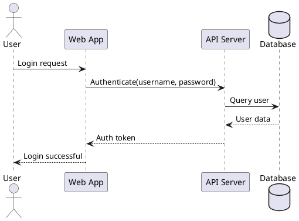
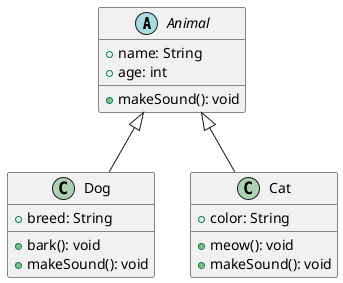
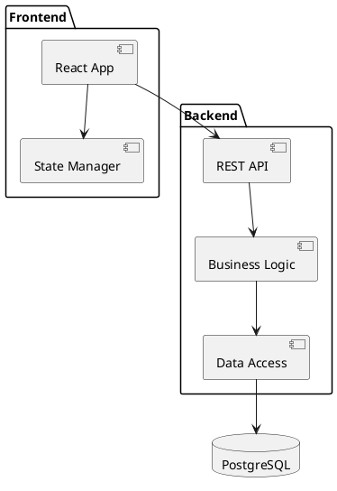
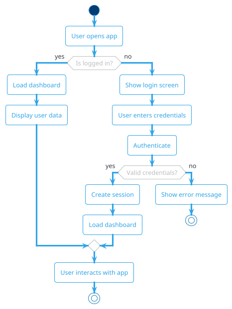
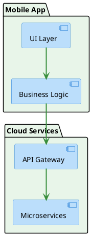
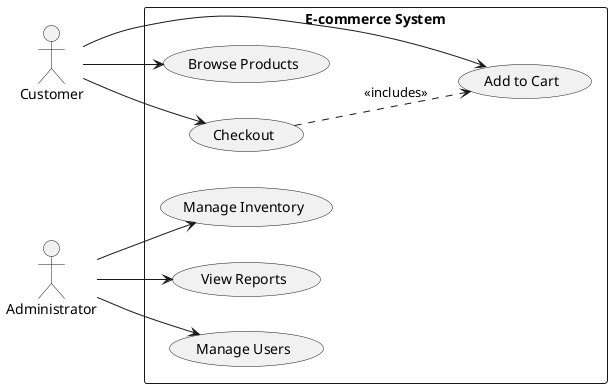
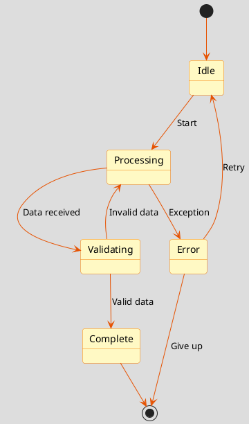
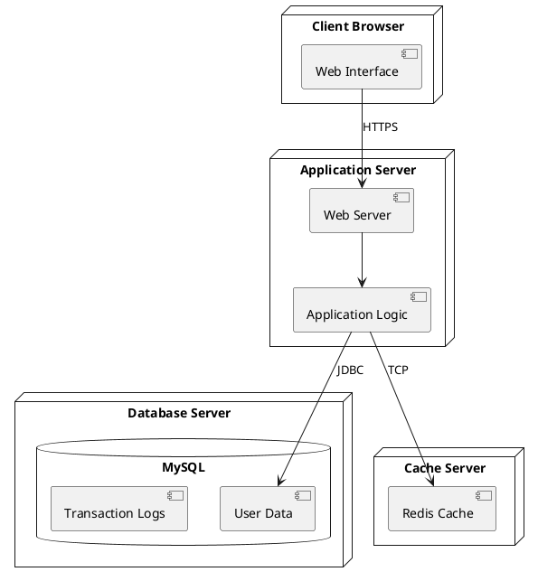

If you are a user who wants to publish pages to Confluence, you should install the package [markdown-to-confluence](https://pypi.org/project/markdown-to-confluence/) from PyPI. If you are a developer who wants to contribute, you should clone the repository [md2conf](https://github.com/hunyadi/md2conf) from GitHub.

[PlantUML](https://plantuml.com/) is an open-source tool that allows you to create diagrams from a plain text language. You can include PlantUML diagrams in your documents to create visual representations of systems, processes, and relationships.

## Sequence Diagram

Sequence diagrams show how objects interact with each other over time. They are useful for modeling the dynamic behavior of a system and understanding message flows between components.

## Class Diagram

Class diagrams visualize the structure of a system by showing its classes, attributes, methods, and relationships. They are essential for object-oriented design.

## Component Diagram

Component diagrams illustrate the organization and dependencies among software components, helping to visualize system architecture.

## Theme Customization Examples

PlantUML supports various built-in themes that change the visual appearance of diagrams. You can apply themes globally using the `--plantuml-theme` CLI option or per-diagram using YAML front-matter.

### Themed Class Diagram (bluegray)

This example demonstrates a class diagram with the **bluegray theme** applied via YAML front-matter. The theme provides a modern, professional appearance with blue-gray colors.

**Configuration**: Uses `theme: bluegray` in the diagram's YAML front-matter.

### Activity Diagram with cerulean-outline Theme

This activity diagram uses the **cerulean-outline theme**, which provides a clean, outlined style with cerulean blue accents. This theme works well for flowcharts and activity diagrams.

**Configuration**: Can be applied with `--plantuml-theme cerulean-outline` CLI option.

## Skinparam Customization Examples

Skinparams allow fine-grained control over diagram styling by setting specific visual properties. You can apply skinparams globally using `--plantuml-skinparam key=value` CLI option or per-diagram using YAML front-matter.

### Styled Sequence Diagram

This sequence diagram demonstrates custom styling with **skinparams** for background color and arrow thickness.

**Configuration**: Uses `skinparams` in YAML front-matter with `backgroundColor` and `sequenceArrowThickness` settings.

### Component Diagram with Custom Colors

This component diagram uses skinparams to customize colors for packages, components, and connections.

**Configuration**: Can be applied with multiple `--plantuml-skinparam` options like `--plantuml-skinparam packageBackgroundColor=#E8F5E9 --plantuml-skinparam componentBackgroundColor=#BBDEFB`.

## Include File Examples

Include files allow you to define reusable PlantUML configurations, styles, or standard elements that can be shared across multiple diagrams. You can specify includes globally using `--plantuml-include path/to/file.puml` CLI option or per-diagram using YAML front-matter.

### Use Case Diagram with Standard Elements

This use case diagram demonstrates using an include file that might define standard actors, styles, or common use cases used across your documentation.

**Configuration**: Can be applied with `--plantuml-include figure/plantuml-common.puml` CLI option or via YAML front-matter `includes: [figure/plantuml-common.puml]`.

## State Diagram with Combined Configuration

This state diagram demonstrates using **multiple configuration options together**: theme, skinparams, and custom styling for a cohesive appearance.

**Configuration**: Combine `--plantuml-theme` with multiple `--plantuml-skinparam` options for comprehensive customization.

## Deployment Diagram

Deployment diagrams show the physical architecture of a system, including hardware nodes and the software components deployed on them.

**Configuration**: Uses default styling; can be customized with any of the above options.

